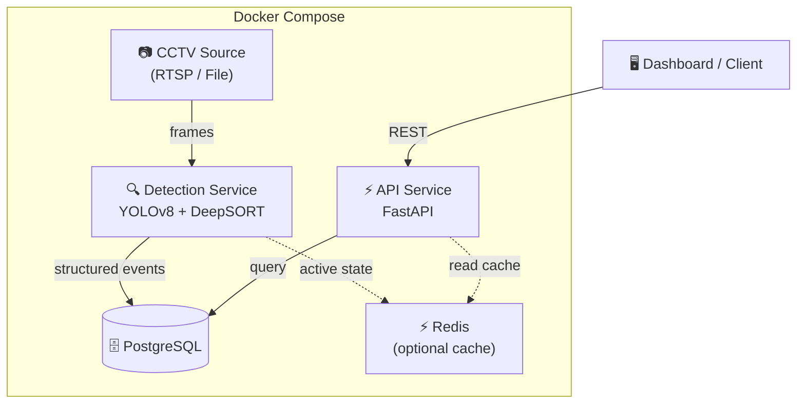

# Store Intelligence — Architecture

## System Overview

## Service Boundaries

| Service | Port | Responsibility |
|---------|------|----------------|
| **api** | 8000 | REST API, Prometheus metrics, event queries |
| **detection** | 8001 | Frame ingestion, YOLO inference, DeepSORT tracking, event emission |
| **postgres** | 5432 | Persistent event + zone storage |
| **redis** *(future)* | 6379 | Active-state cache (current tracks, zone occupancy) |

## Data Flow

1. **Detection** reads raw CCTV frames (RTSP or file).
2. YOLOv8 produces bounding boxes; DeepSORT assigns persistent track IDs.
3. Business-logic rules (zone dwell, path analysis) emit **structured events** to PostgreSQL.
4. **API** serves these events via REST endpoints, with Prometheus metrics for observability.
5. An optional **Redis** layer caches live state (e.g., "who is in zone X right now?").

## Extension Points

- **`shared/models/`** — Add new SQLAlchemy models; they'll be auto-detected by Alembic.
- **`api/main.py`** — Mount new routers for analytics, dashboards, webhooks.
- **`detection/main.py`** — Replace the placeholder loop with real inference pipeline.
- **`db/init.sql`** — Extend the bootstrap schema (or migrate to Alembic).
- **`docker-compose.yml`** — Add Redis, Nginx, or worker containers as needed.

## Key Design Decisions

| Decision | Rationale |
|----------|-----------|
| No face recognition | Privacy-first; the system tracks bodies/objects, not identities |
| Async everywhere | CCTV processing is I/O-heavy; async keeps throughput high |
| Structured JSON logs | Machine-parseable from day one — ready for ELK / CloudWatch |
| Pydantic Settings | Single source of truth for config; env-var driven, no hardcoding |
| Prometheus metrics | Industry-standard; works with Grafana dashboards out of the box |
